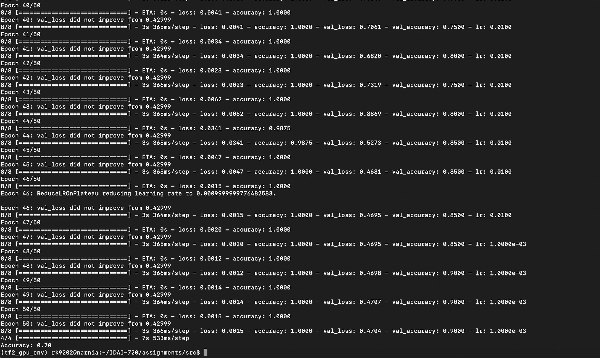

[](../README.md)   
[Syllabus](../README.md) |
[Schedule](../schedule.md) |
[Assignments](README.md) |
[Term Paper](../termpaper/README.md) |
[Instructor](http://zhe-yu.github.io) 
## Data Annotation

### 1. Copy the image files to your local machine.
- open a terminal on your local machine
```
scp -r RIT-USERNAME@narnia.gccis.rit.edu:/local/datasets/idai720/images TARGET-LOCAL-DIRECTORY/IDAI-720/assignments/
```

### 2. Annotate every image in [train.csv](data/train.csv) and [test.csv](data/test.csv).
- Open the corresponding image
- Give your own binary rating on the image (_1_ if you think the face is beautiful, otherwise _0_)
- Fill in your ratings in the _"Rating"_ column in both files (you need to rate 100 + 100 images)

### 3. Get the annotated data files to your CS Cluster.
- Push the local changes (of train.csv and test.csv) to your GitHub repo.
- Log into your CS Cluster and pull from the GitHub repo.

## Train a VGG-16 model on train.csv and test it on test.csv
- Get to _src/_
- Modify the GPU to use in the [vgg_pre.py](src/vgg_pre.py) file
```
os.environ["CUDA_VISIBLE_DEVICES"]="0" # Change the number 0 to your corresponding GPU ID in the Google Sheet
```
- Run the A1.py file
```
(tf2_gpu_env) YOUR-PATH/IDAI-720/assignments/src$ python3 A1.py
```
This will usually takes 5-10 minutes on the GPU node but will take hours on your laptop with CPUs.
- Take a screenshot when it is done:

- Save the screenshot as [_/screenshots/A1.png_](screenshots/A1.png).
- Push everything to GitHub repo.

## Rubric
- 2 points if the screenshot of A1.png exists (and is different from the example above).
- 2 points if the training accuracy shown in the screenshot is higher than 0.8.
- 2 points if the testing accuracy reported at the end is higher than 0.6.
- **Note**: consider re-annotate more carefully if the training or testing accuracy is low.
 
